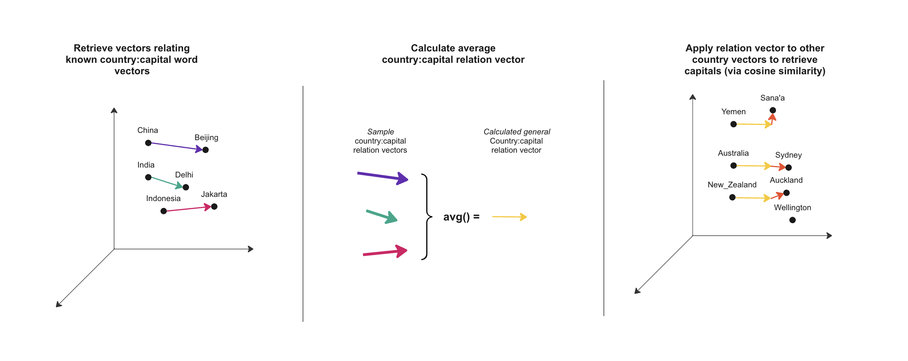
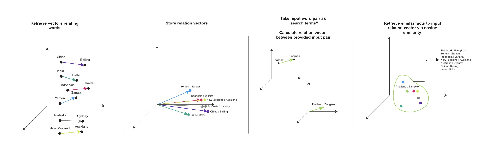

# Embeddings Models as a Knowledge store

Relational Databases remain to be an industry standard. These store knowledge in rigidly defined schemas, which makes them easy to understand, troubleshoot, implement and interact with. Graph Databases present an alternative to Relational DBs - storing data in an intuitive format with more flexible schemas. These work well for representations of networks - electrical networks, communications, logistics, etc.

A common problem in software development is poor **data quality**. In my experience, a common feature of issues relating to data quality is that the requirements of the system in question have changed since its design. For example, a job scheduling register initially designed for humans to interact with suddenly requires machine interaction, and existing free-text fields in the register are unsuitable for that. Or, a schema containing asset data requires an additional field estimating rainfall at each asset, to be used in a rust prevention work programme. The rigidity of the relational database schema becomes a restriction rather than a benefit here. To estimate rainfall and understand the free-text fields, we'll likely have to move out of the database and into ad-hoc local data manipulation.

Data quality issues seem unrelated to type of database - relational, graph, whatever - we select. These methods have difficulties in that editing their schema to support new concepts is a costly exercise.

Semantic space 

If we were to take a word and translate it in this space, moving it along one (likely many more) of these dimensions, we would change its meaning. In this way, we can take the vector for `'queen'` and adjust it by some vector to return `'king'`. This is a classic example used to explain embeddings spaces, but I feel this notion could be explored further.

That we can move from one point in space, move along some bearing and land on a related term implies that a populated semantic space contains facts - like a triple:

`king -> gender_counterpart -> queen`

`gender_counterpart` relationships are not directly visible or explicitly written, but are captured in the words' positions in semantic space.

This translation in the embeddings space could be likened to drawing a triple, or an edge, in a knowledge graph, or adding a record to a relational database. In the above example, we took two symbols, 'queen' and 'king', and (implicitly) drew a 'gender_counterpart' connection between the two, thus realising a fact.
Could we extend this analogy and somehow interact with embeddings spaces as a traditional knowledge store?
How would we query it? i.e.:

`SELECT female_term, male_term FROM gendered_words`

What would the advantages of this arrangement be?
How could such a model be trained for arbitrary use-cases, like enterprise?

### Experiment 1: Proving the basic idea

I'm going to start with the simplest example. I elected to choose a pretrained word2vec model, `'word2vec-google-news-300'`. As the name suggests, it is trained on a dataset scraped from Google News.

In `countries_to_capitals.py`, I've built a script which takes twenty country-to-capital pairs and averages the vectors relating each, attempting to yield a vector which could be used to retrieve the Capital city of a wider sample of countries.

### Results

| Country                          | Capital       | guess_capital  |
|----------------------------------|---------------|----------------|
| China                            | Beijing       | Beijing        |
| India                            | New_Delhi     | Delhi          |
| United_States                    | WashingtonDC  | Washington_DC  |
| Indonesia                        | Jakarta       | Jakarta        |
| Pakistan                         | Islamabad     | Islamabad      |
| **... (40 records omitted) ...** |
| Yemen                            | Sana'a        | Sana'a         |
| Madagascar                       | Antananarivo  | Antananarivo   |
| North_Korea                      | Pyongyang     | Pyongyang      |
| Australia                        | Canberra      | Sydney         |
| Ivory_Coast                      | Yamoussoukro  | Abidjan        |

**Number of correct guesses:** 39 out of 51 records.

#### Thoughts

This provides some evidence that at least this model has the semantic precision required to make retrievals of the sort we expect from a traditional database - at least in a very simple example with countries and capitals.

I should note that we've made a bold assumption here that we can determine a single universal relation vector (a linear operation) for countries and capitals based on a simple average. In reality the relation vector would vary for each instance of a Country. In short, the similarity searches we do to jump to the nearest word (the red arrows in the above diagram) are doing a lot of work here.

Many incorrect guesses seem to point toward the most populous city in the country which could be due to over-representation in the training set. Anecdotally, I know a lot of humans mistake Auckland and Sydney for capitals.

### Experiment 2: Generalised fact retrieval from Embedding Space

In Experiment 1, we showed evidence that by processing the word embeddings relating a class of terms to another class of terms, we can somewhat reliably explore the semantic space around other words in the first class to find their counterparts in the second class.

In this experiment, I'd like to try and generalise the method in Experiment 1. Rather than primitively bashing together a relation vector by averaging the vector from multiple known class-to-class examples, can we use more traditional data science techniques to bundle facts of similar meaning together?

On paper, we should be able to store a relation vector in the same way we store a word vector. From there, traditional clustering and similarity measures should be applicable.

In `save_relations.py`, I've built a script which takes the most popular terms in the model's vocabulary and saves the relation vectors between each, as above. This is a memory-heavy process, so I've used .h5 binaries for storage.

#### Results

`python save_relations.py 20000`

`python explore_relations.py China Beijing`

| left                             | right        |
|:---------------------------------|:-------------|
| Russia                           | Moscow       |
| Korea                            | Seoul        |
| Malaysia                         | Kuala_Lumpur |
| Japan                            | Tokyo        |
| Turkey                           | Ankara       |
| **... (14 records omitted) ...** |              |
| India                            | Delhi        |
| Thailand                         | Bangkok      |
| Egypt                            | Cairo        |
| Pakistan                         | Islamabad    |
| Indonesia                        | Jakarta      |

#### Thoughts

With filtering, of 100 similar examples, we get 24 that are valid pairs. Most of these seem correct.

- Brazil got Rio de Janeiro, rather than Brasilia. Rio de Janeiro is a larger city, and was also the capital until 1960.
- Italy got Turin, rather than Rome. This is unusual, because I don't think the Google News dataset goes back to the 1860s.
- Australia got Sydney, rather than Canberra
- Germany Munich, rather than Berlin
- We got some weird Continent to City pairs returned - Africa and Nairobi, Europe and Athens.

It would seem it's hard to distinguish between Countries/Capitals and other "big land, little land" pairs.

So, a mild success in 'querying' an embeddings model, using an example fact.

#### Experimenting with other fact pairs

Countries and Capitals are an easy pick, especially for a model trained on a News dataset. What about other Relations?

Ideas:
- Sportspeople and their main sports
- Celebrities and their country of origin
- Biological class-to-instance pairs - i.e. canine to dog, feline to cat, murine to mouse
- Gender counterparts

Let's try some.

`python explore_relations.py federer switzerland`

| left        | right   |
|:------------|:--------|
| Switzerland | Roddick |
| Germany     | Agassi  |
| Italy       | Safina  |

...uhhh...

`python explore_relations.py mouse murine`

| left | right    |
|:-----|:---------|
| RA   | keyboard |
| IL   | button   |
| ii   | wizard   |
| RNA  | app      |
| NA   | locate   |

...uh-oh.

Unfortunately, even when trying many different example pairs, we get very poor performance - mostly junk that's returned. My guess is that these relations are much less salient in the embedding space than that of a Country-to-Capital relation. That is, "dog" and "canine" will be mentioned in fewer News articles than countries and capitals, so the vector representing their meaning will be less accurate.

The idea of a signal-to-noise ratio comes to mind here: we get noisier results from less crystallised topics, and clearer results when looking into more culturally prominent entities. 

This Word2Vec model is quite lightweight - a couple of gigabytes and 300 dimensions. It may be that a larger, say, Sentence Transformer type model would capture relationships in more niche topics with more detail (although, we'd then require additional overhead of managing sub-word vocabularies and likely require more computational capability than my laptop).

### Future Work

- The "averaged relation vector" approach works in the example, but a trained MLP to relate instances to classes might be a better technique. 
  - Bonus: could we provide column headers a la `SELECT female_term, male_term` and have the model find related instances from each column header?
- Explain how a model might be trained to support a vocabulary of symbols internal to an organisation, i.e. Asset IDs.
- Explain advantages of storing knowledge in high-dimensional semantic space, rather than low-dimensional fact tables (predictions, fixing poor data quality, massively more flexible schema)
  - Fixing poor data quality is basically the entire point of this experimentation so that I'm first mentioning it here is kinda silly
